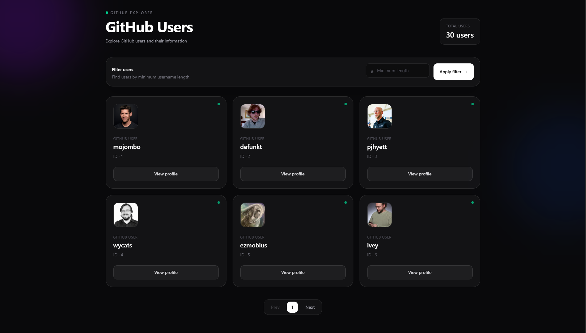
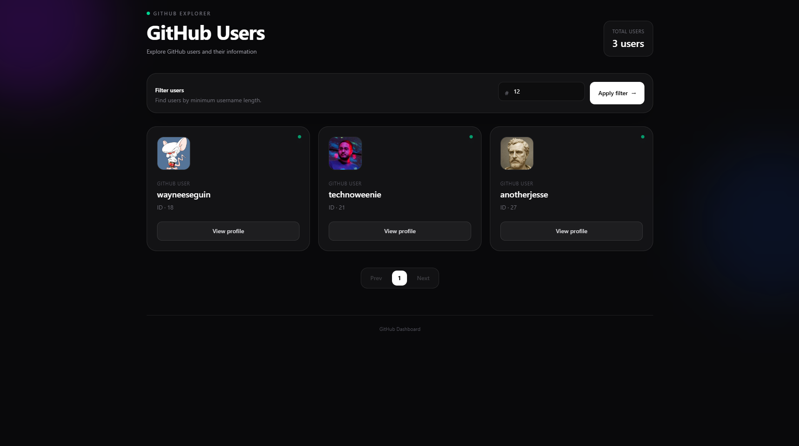
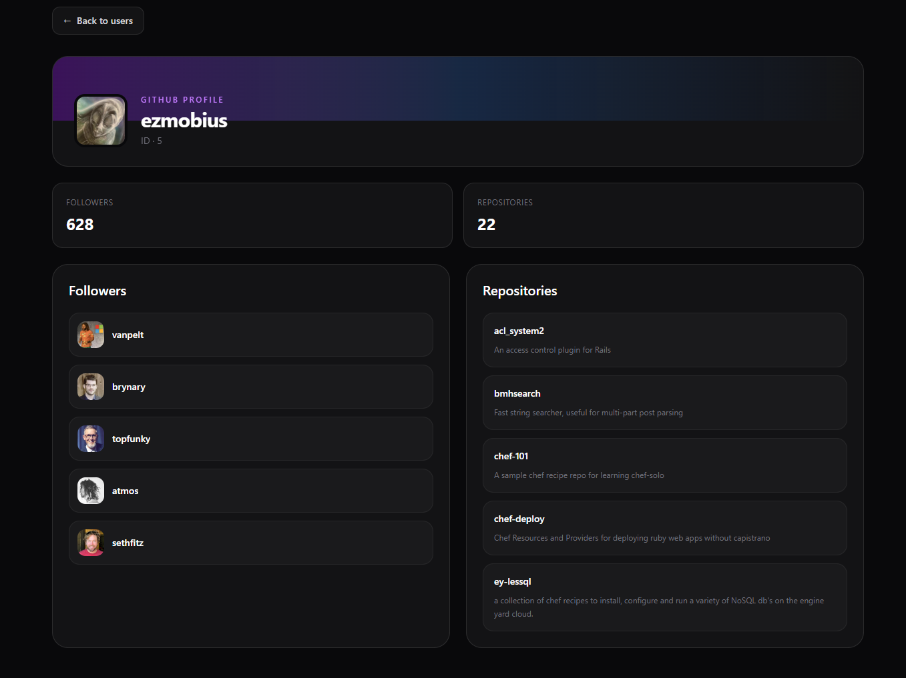
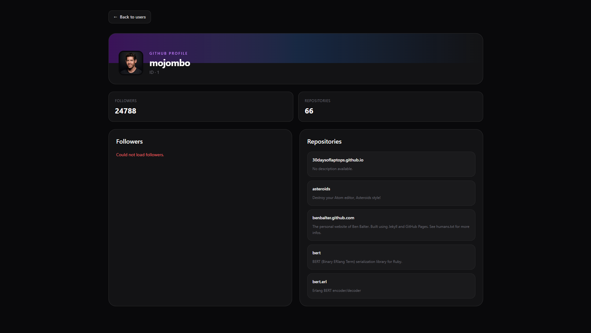
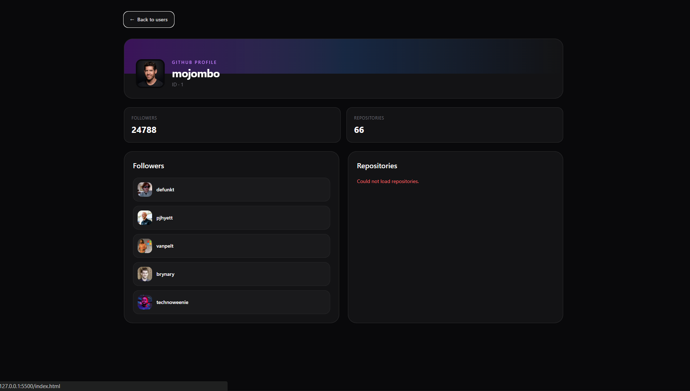
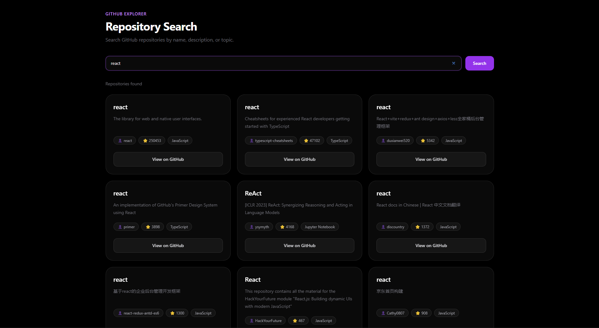

# GitHub Explorer

A responsive GitHub Explorer application built with **HTML5, Tailwind CSS, TypeScript, and the GitHub REST API**.

The application allows users to browse GitHub users, search and sort users on the currently loaded page, navigate between user pages, inspect detailed profiles, and search GitHub repositories with pagination and complete loading, success, empty, and error states.

> **Project Focus:**  
> This project demonstrates a practical **JavaScript-to-TypeScript migration** with strict type safety, generic API communication, service-layer architecture, typed DOM interactions, utility types, union types, asynchronous programming, data transformation, pagination, and robust error handling.

---

## Key Features

### User Explorer

- **User Discovery:** Fetch and display public GitHub users.
- **User Search:** Search loaded users by login/username or name.
- **Name Sorting:** Sort the currently loaded users from **A → Z** or **Z → A**.
- **Current-Page Search & Sort:** Search and sorting are performed only on the users already loaded for the current API page.
- **API Pagination:** Navigate between user pages using GitHub's `/users` API pagination.
- **Empty Search State:** Displays a clear message when no users match the current search.
- **User Profiles:** Open a dedicated profile page for an individual GitHub user.

### User Profile

- Display detailed GitHub user information.
- Display follower information.
- Display repository information.
- Fetch followers and repositories concurrently using `Promise.allSettled()`.
- Handle partial API failures without breaking the entire profile page.

### Repository Search

- Dedicated `repositories.html` page.
- Search GitHub repositories using the GitHub repository search API.
- Display:
  - Repository name
  - Description
  - Owner login
  - Star count
  - Programming language
  - GitHub repository URL
- Repository pagination with Previous and Next controls.
- Empty-query validation.
- Empty-result state.
- HTTP/API error state.
- Network error handling.
- Loading state with skeleton UI.
- Typed API response and UI models.
- Transform API response data before rendering.

---

## Tech Stack

| Technology | Purpose |
| --- | --- |
| **HTML5** | Semantic structural markup |
| **Tailwind CSS** | Responsive styling and utility classes |
| **TypeScript** | Type-safe application architecture and compile-time validation |
| **GitHub REST API** | External data provider |
| **Fetch API** | Native HTTP communication |
| **Node.js / npm** | Package management and development tooling |
| **TypeScript Compiler (`tsc`)** | Compiles TypeScript source files into browser-compatible JavaScript |

---

# Getting Started

## Prerequisites

Ensure the following are installed:

- [Node.js](https://nodejs.org/)
- [Git](https://git-scm.com/)
- A local development server such as VS Code Live Server

---

## Installation

Clone the repository:

```bash
git clone <your-repository-url>
````

Navigate into the project:

```bash
cd <project-folder>
```

Install dependencies:

```bash
npm install
```

---

## Build & Development

### Compile TypeScript

Compile the TypeScript source files:

```bash
npm run build
```

The compiled JavaScript files are generated inside the `dist/` directory.

### TypeScript Watch Mode

To automatically recompile TypeScript files whenever changes are made:

```bash
npm run watch
```

### Type Check

The project must compile without TypeScript errors:

```bash
npx tsc
```

A successful type check produces no error output.

> **Note:** Browsers execute the compiled JavaScript files in the `dist/` directory. The TypeScript source files inside `src/` are the source of truth.

---

# Project Structure

```text
Advanced-Js-Assignment/
│
├── index.html
├── profile.html
├── repositories.html
│
├── src/
│   ├── app.ts
│   ├── profile.ts
│   ├── repositories.ts
│   │
│   ├── services/
│   │   └── apiService.ts
│   │
│   ├── types/
│   │   └── card.ts
│   │
│   └── utils/
│       └── api.ts
│
├── dist/
│   └── compiled JavaScript files
│
├── screenshots/
│   ├── image.png
│   ├── filtered.png
│   ├── profile.png
│   ├── onlyRepos.png
│   └── onlyFollowers.png
│
├── tsconfig.json
├── package.json
└── README.md
```

---

# File Responsibilities

| File                | Responsibility                                                                           |
| ------------------- | ---------------------------------------------------------------------------------------- |
| `index.html`        | Main GitHub users dashboard UI                                                           |
| `profile.html`      | User profile page structure                                                              |
| `repositories.html` | Repository search page structure                                                         |
| `app.ts`            | User search, sorting, pagination, state management, transformation, and DOM rendering    |
| `profile.ts`        | Profile page orchestration and concurrent follower/repository loading                    |
| `repositories.ts`   | Repository search, pagination, loading/error/empty states, transformation, and rendering |
| `apiService.ts`     | Centralized GitHub API service layer                                                     |
| `api.ts`            | Generic HTTP request helper                                                              |
| `card.ts`           | Interfaces, utility types, and UI models                                                 |
| `tsconfig.json`     | TypeScript compiler configuration                                                        |
| `dist/`             | Compiled JavaScript executed by the browser                                              |

---

# Architecture

The application follows a layered architecture that separates UI logic from API communication.

```text
HTML Pages
    │
    ▼
UI / Page Logic
(app.ts / profile.ts / repositories.ts)
    │
    ▼
ApiService
(apiService.ts)
    │
    ▼
Generic API Helper
(api.ts)
    │
    ▼
Fetch API
    │
    ▼
GitHub REST API
```

## Separation of Responsibilities

### UI Layer

Responsible for:

* Reading user input
* Handling DOM events
* Managing UI state
* Updating the page
* Rendering transformed data

### ApiService Layer

Responsible for:

* Building GitHub endpoint URLs
* Calling the generic API helper
* Returning typed API data
* Keeping GitHub-specific API logic away from UI code

### Generic API Layer

Responsible for:

* Executing `fetch()`
* Checking `response.ok`
* Parsing JSON
* Returning typed success/error results
* Handling network failures

This keeps the generic HTTP logic reusable and prevents GitHub-specific logic from being placed inside the generic API helper.

---

# TypeScript Architecture

The project uses strict TypeScript configuration and strongly typed application models.

## Interfaces

Interfaces define the expected structure of data received from the GitHub API.

Example:

```ts
export interface GitHubUser {
  login: string;
  id: number;
  avatar_url: string;
  name?: string | null;
  public_repos?: number;
  followers?: number;
}
```

This provides compile-time validation when working with GitHub user data.

---

# Utility Types

The project uses TypeScript utility types such as `Pick` and `Omit` to create smaller models for specific parts of the application.

Example:

```ts
export type GitHubUserBasic = Pick<
  GitHubUser,
  "login" | "id" | "avatar_url" | "name"
>;
```

A UI-specific user model is then created using `Omit`:

```ts
export type UserCard = Omit<
  GitHubUserBasic,
  "avatar_url"
> & {
  avatar: string;
};
```

This avoids unnecessarily passing the complete API model to the UI.

---

# Repository UI Model

Repository API data is transformed into a smaller UI-specific model.

```ts
export type RepositoryCard = Pick<
  GitHubRepository,
  "name" |
  "description" |
  "stargazers_count" |
  "language" |
  "html_url"
> & {
  ownerLogin: string;
};
```

The API response contains nested owner information:

```ts
repository.owner.login
```

The UI model transforms this into:

```ts
repository.ownerLogin
```

This keeps the rendering layer independent from the exact structure of the external API response.

---

# Data Transformation

The application transforms external API data before passing it to the rendering functions.

For repositories:

```ts
function transformRepository(
  repository: GitHubRepository,
): RepositoryCard {
  return {
    name: repository.name,
    description: repository.description,
    stargazers_count: repository.stargazers_count,
    language: repository.language,
    html_url: repository.html_url,
    ownerLogin: repository.owner.login,
  };
}
```

The flow is:

```text
GitHub API Response
        ↓
GitHubRepository
        ↓
transformRepository()
        ↓
RepositoryCard
        ↓
renderRepositories()
        ↓
DOM
```

This approach keeps API models and UI models separate and avoids directly coupling the rendering code to the external API structure.

---

# Generic API Helper

The project uses a reusable generic API helper:

```ts
export type ApiResult<T> =
  | {
      success: true;
      data: T;
    }
  | {
      success: false;
      error: string;
    };
```

The generic request function is:

```ts
export async function apiRequest<T>(
  url: string,
): Promise<ApiResult<T>> {
  try {
    const response = await fetch(url);

    if (!response.ok) {
      return {
        success: false,
        error: `Request failed with status ${response.status}`,
      };
    }

    const data: T = await response.json();

    return {
      success: true,
      data,
    };
  } catch (error) {
    console.error("API request failed:", error);

    return {
      success: false,
      error: "Network error. Please try again.",
    };
  }
}
```

The `<T>` generic allows the same helper to work with different API response types.

For example:

```ts
apiRequest<GitHubUser[]>()
```

or:

```ts
apiRequest<GitHubRepositorySearchResponse>()
```

This avoids using `any` while keeping the HTTP helper reusable.

---

# Error Handling

The application distinguishes between HTTP/API failures and network failures.

## HTTP Errors

The generic API helper checks:

```ts
if (!response.ok)
```

If GitHub returns an unsuccessful HTTP status such as `403` or `404`, an error result is returned.

Example:

```text
Request failed with status 403
```

## Network Errors

Network failures are caught using `try/catch`:

```ts
catch (error) {
  return {
    success: false,
    error: "Network error. Please try again.",
  };
}
```

The UI then displays an appropriate error state.

---

# Feature 1: User Search & Sorting

The Users dashboard allows searching and sorting without making additional API requests.

## Search

Users can search the currently loaded page by:

* GitHub login/username
* User name

The search is performed client-side.

```text
Current API Page
       ↓
Search
       ↓
Matching Users
       ↓
Sort
       ↓
Render
```

No additional GitHub API request is made when the search text changes.

## Sorting

Users can select:

```text
A → Z
Z → A
```

Sorting is applied only to the currently loaded users.

The original API response is not mutated. A derived array is created before sorting.

---

# Feature 1: User Pagination

The Users API is paginated through GitHub's `/users` endpoint.

The application loads a page of users and uses the GitHub user ID as the pagination cursor for subsequent requests.

Example:

```text
GET /users?per_page=10
        ↓
First page
        ↓
Last user ID
        ↓
GET /users?per_page=10&since=<last-user-id>
        ↓
Next page
```

The application also supports Previous and Next navigation while preserving the current search and sorting behavior.

---

# Feature 2: Repository Search

The application provides a dedicated repository search page:

```text
repositories.html
```

The page communicates with the GitHub repository search endpoint:

```http
GET https://api.github.com/search/repositories?q=react&page=1&per_page=10
```

The API response contains:

* `total_count`
* `incomplete_results`
* `items`

Only the fields required by the UI are represented in the TypeScript models.

---

# Repository Search Flow

```text
User enters search term
        ↓
Validate query
        ↓
ApiService
        ↓
Generic apiRequest<T>()
        ↓
GitHub Repository Search API
        ↓
GitHubRepository[]
        ↓
transformRepository()
        ↓
RepositoryCard[]
        ↓
renderRepositories()
        ↓
Repository Cards
```

---

# Repository UI States

The repository page supports the following UI states:

## Idle

Initial state before a repository search is performed.

## Loading

Displayed while the GitHub API request is in progress.

A skeleton loading UI is shown while waiting for the response.

## Success

Displayed when repositories are successfully returned.

## Empty

If GitHub returns zero repositories, the application displays:

```text
No repositories found.
```

## Error

HTTP and network failures display a dedicated error state instead of partially rendering repository data.

---

# Empty Query Validation

An empty repository search is rejected before making an API request.

```ts
const query = searchInput.value.trim();

if (!query) {
  searchError.textContent =
    "Please enter a repository search term.";

  return;
}
```

This prevents unnecessary requests to GitHub.

---

# Repository Pagination

Repository results are displayed ten items per page.

The application maintains:

```ts
let currentPage = 1;
const repositoriesPerPage = 10;
```

The Next and Previous controls request the appropriate repository page:

```http
/search/repositories?q=react&page=1&per_page=10
/search/repositories?q=react&page=2&per_page=10
```

If a page returns fewer than ten repositories, the application disables the Next button.

---

# Concurrent Requests

The profile page requires multiple independent resources, including:

* Followers
* Repositories

These requests are handled concurrently using:

```ts
Promise.allSettled()
```

## Why `Promise.allSettled()`?

`Promise.all()` rejects the entire operation if any individual promise fails.

For example:

```text
Followers request  → Success
Repositories request → Error
```

With `Promise.all()`, the entire operation would be rejected.

With `Promise.allSettled()`:

```text
Followers request      → Success → Followers displayed
Repositories request   → Error   → Repository error displayed
```

This allows successfully retrieved information to remain available even when another independent API request fails.

This makes the profile page more resilient to partial API failures.

---

# UI State Management

The application explicitly represents UI states using TypeScript union types.

Example:

```ts
type UiState =
  | "idle"
  | "loading"
  | "success"
  | "empty"
  | "error";
```

This prevents arbitrary state values and makes the UI state handling predictable.

---

# Typed DOM Events

DOM events are explicitly typed.

For example:

```ts
searchForm.addEventListener(
  "submit",
  (event: SubmitEvent): void => {
    event.preventDefault();
    void searchRepositories();
  },
);
```

Mouse events are also typed:

```ts
async function goToNextPage(
  event: MouseEvent,
): Promise<void> {
  event.preventDefault();
}
```

This provides better editor support and compile-time validation.

---

# Async/Await

The application uses modern asynchronous programming with `async/await`.

Example:

```ts
const repositories =
  await apiService.searchRepositories(
    currentQuery,
    currentPage,
    repositoriesPerPage,
  );
```

Errors are handled with:

```ts
try {
  // API request
} catch (error) {
  // Error handling
} finally {
  // Cleanup
}
```

The `finally` block ensures that loading-related UI cleanup occurs after the request completes regardless of whether it succeeds or fails.

---

# TypeScript Configuration

The project uses `tsconfig.json` to control TypeScript compilation.

Important settings include:

* `strict: true` — Enables strict type checking.
* `noImplicitAny: true` — Prevents variables and parameters from implicitly receiving the `any` type.
* `rootDir: "./src"` — Defines the TypeScript source directory.
* `outDir: "./dist"` — Places compiled JavaScript files in the `dist` directory.
* `module` — Configures the JavaScript module system.
* `target` — Configures the JavaScript output version.

The project should compile with zero TypeScript errors:

```bash
npx tsc
```

---

# GitHub API Endpoints

The application uses the following GitHub REST API endpoints:

```http
GET https://api.github.com/users

GET https://api.github.com/users/{username}

GET https://api.github.com/users/{username}/followers

GET https://api.github.com/users/{username}/repos

GET https://api.github.com/search/repositories?q={query}&page={page}&per_page={perPage}
```

These endpoints are accessed through `ApiService`.

The generic API helper does not contain GitHub-specific endpoint logic.

> **Rate Limit Note:**
> Unauthenticated GitHub API requests are subject to rate limits. Heavy usage may result in HTTP `403 Forbidden` responses.

---

# Design Patterns & Concepts Demonstrated

## Interfaces

Used to define contracts for API response structures.

Example:

```ts
interface GitHubUser {
  login: string;
  id: number;
  avatar_url: string;
}
```

## Generics

Used by the reusable API helper:

```ts
apiRequest<T>()
```

This allows the same HTTP utility to safely handle different response types.

## Union Types

Used for API results:

```ts
type ApiResult<T> =
  | {
      success: true;
      data: T;
    }
  | {
      success: false;
      error: string;
    };
```

And UI states:

```ts
type UiState =
  | "idle"
  | "loading"
  | "success"
  | "empty"
  | "error";
```

## Utility Types

The project uses:

* `Pick`
* `Omit`

to derive focused UI models from larger API models.

## Type Narrowing

The application uses checks such as:

```ts
error instanceof Error
```

to safely determine the type of caught errors.

## Composition

The application combines small focused modules:

```text
api.ts
    +
apiService.ts
    +
app.ts
    +
profile.ts
    +
repositories.ts
```

rather than relying on complex inheritance.

---

# Data Flow

## Users

```text
index.html
    ↓
app.ts
    ↓
ApiService.getUsers()
    ↓
apiRequest<GitHubUser[]>()
    ↓
GitHub /users API
    ↓
GitHubUser[]
    ↓
transformUser()
    ↓
UserCard[]
    ↓
Search / Sort
    ↓
Render
```

## Repository Search

```text
repositories.html
    ↓
repositories.ts
    ↓
ApiService.searchRepositories()
    ↓
apiRequest<GitHubRepositorySearchResponse>()
    ↓
GitHub Search API
    ↓
GitHubRepository[]
    ↓
transformRepository()
    ↓
RepositoryCard[]
    ↓
Render
```

## Profile

```text
profile.html
    ↓
profile.ts
    ↓
ApiService
    ↓
User + Followers + Repositories
    ↓
Promise.allSettled()
    ↓
Profile UI
```

---

# Testing Checklist

Before submitting the project, verify the following.

## Users

* [ ] Users load successfully.
* [ ] Search by username works.
* [ ] Search by name works.
* [ ] Search applies only to the current loaded page.
* [ ] Search does not make an additional API request.
* [ ] A → Z sorting works.
* [ ] Z → A sorting works.
* [ ] No-match state displays correctly.
* [ ] Next page works.
* [ ] Previous page works.
* [ ] Search and sorting continue to work after pagination.
* [ ] User profile links work.

## Profile

* [ ] Profile information loads.
* [ ] Followers load.
* [ ] Repositories load.
* [ ] Followers and repositories are requested concurrently.
* [ ] Partial failure states work correctly.

## Repository Search

* [ ] Repository search works.
* [ ] Repository name is displayed.
* [ ] Repository description is displayed.
* [ ] Nullable descriptions are handled.
* [ ] Owner login is displayed.
* [ ] Star count is displayed.
* [ ] Nullable language is handled.
* [ ] GitHub repository links work.
* [ ] Next page works.
* [ ] Previous page works.
* [ ] Empty query validation works.
* [ ] Empty query does not make an API request.
* [ ] No-result state displays `No repositories found.`
* [ ] HTTP error state works.
* [ ] Network error state works.
* [ ] Loading state is displayed while requests are in progress.

## TypeScript

* [ ] `npx tsc` completes with zero errors.
* [ ] Compiled files are present in `dist/`.

---

# Screenshots

## Dashboard View



## User Search / Filtered Results



## Profile View



## Profile With Repository Failure



## Profile With Follower Failure



## Repository Search



## Repository Empty State


## Repository Error State


---
